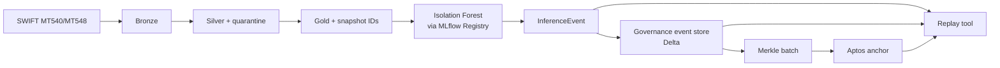

# auditable-ai-lakehouse

An auditable AI architecture for post-trade financial operations, designed to be **audit-ready by design** — data quality, model lifecycle control, and tamper-evident logging are enforced by the architecture itself rather than by process discipline around it.

## The three pillars

1. **Medallion lakehouse** — Bronze, Silver (with quarantine), Gold (with snapshot identifiers).
2. **MLflow lifecycle** — versioned, metric-gated promotion, approver-logged.
3. **Blockchain anchoring** — Merkle roots committed to an independent trust domain.

The **replay tool** ties it all together: given an alert or batch ID, it reconstructs the snapshot, re-runs inference deterministically, verifies the Merkle proof, and reads back the root from the chain.

## Quick links

- [Architecture deep-dive](architecture.md)
- [Replay tool](replay-tool.md)
- [Compliance mapping](compliance-mapping.md)
